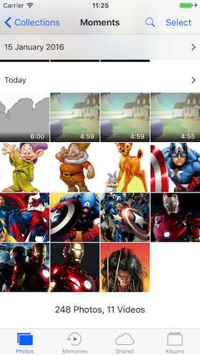

**MyGallery** in  iOS .

Swift 3

Xcode 8.2.1
1. Photos Framework.
2. AVKit framework.
3. PHAsset.
4. AVPlayer
5. AVPlayerViewController.

**MyGallery** is  application for viewing photos and videos.

Submitted by: **Mayuresh Rao**

## User Stories

The following **required** functionality is complete:

* [x] User get the option for selecting photos and videos in the phone.
* [x] User can pause and play video in the video player .

The following features are implemented:

Completed user stories:

* [x] Large number of images can be uploaded in the gallery.
* [x] Tested works seamless for more than 1000 images.

## Video Walkthrough 

Here's a walkthrough of implemented user stories:

 

## Future implementation

The following features can be implemented in the current project:

* [x] User can view the images in moments.
* [x] User allow to take photos and videos and upload them in the real time.
* [x] User allowed to add filters to photos and videos.
* [x] Sharing option and adding extensions.
* [x] User can create there own albums.

